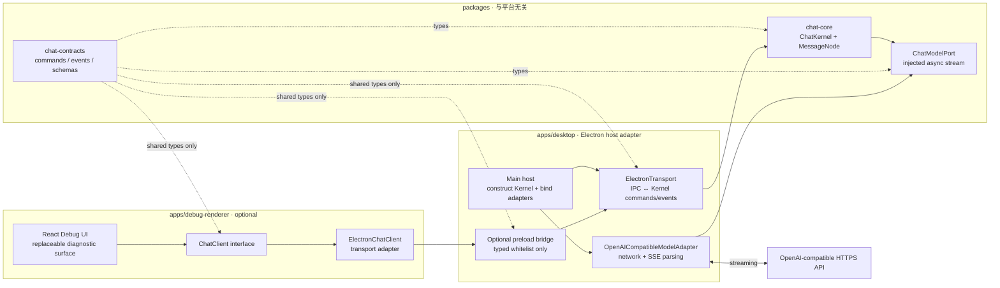
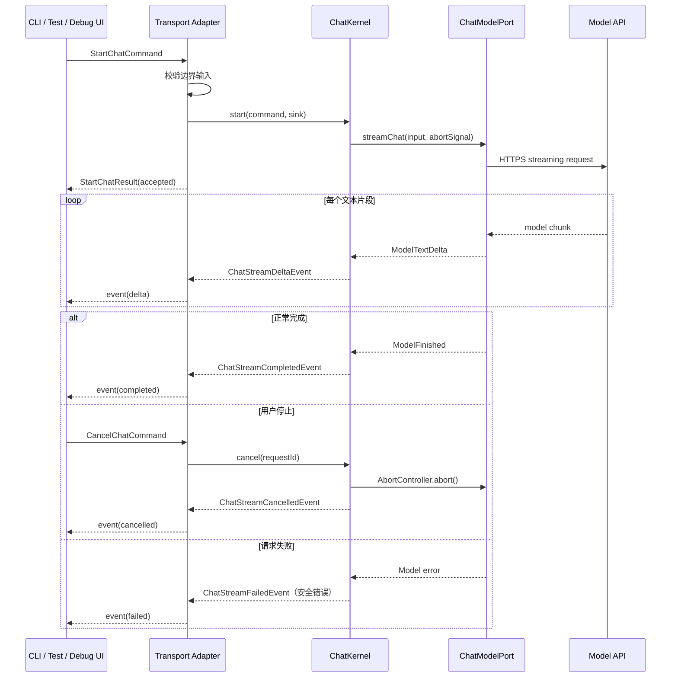
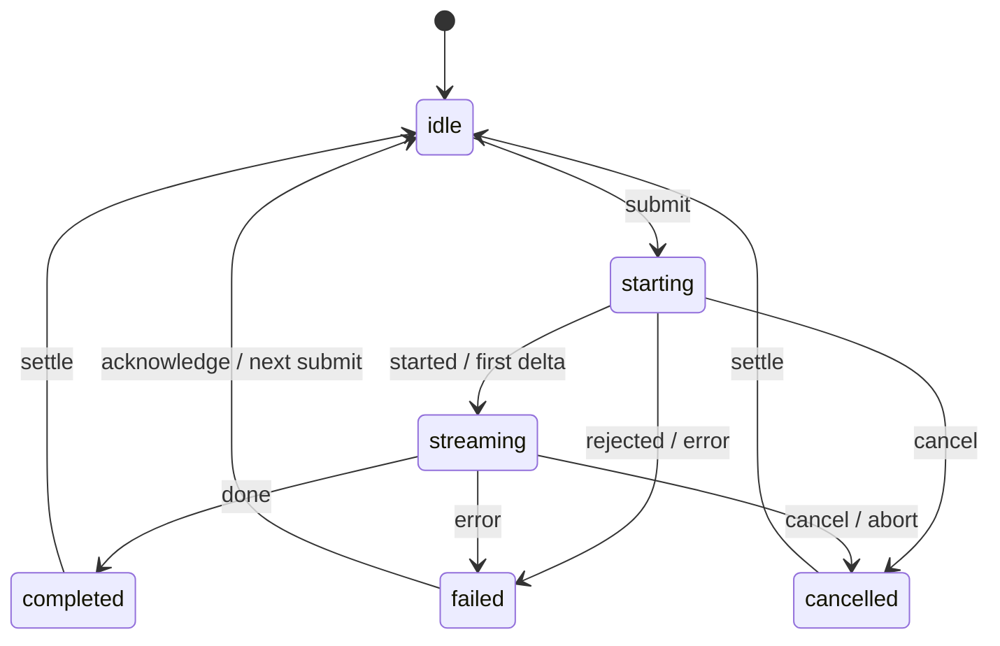

# Electron 单模型单会话流式对话内核

> 文档状态：可执行设计稿  
> 当前阶段：项目初始化与无 UI 内核优先  
> 目标读者：负责内核、适配器、Electron 宿主、可选 Debug UI 与测试的执行 Agent

> 本次修订：内核与前端完全解耦。前端不再是内核的实现前提；本阶段可以完全不创建 React 页面。若创建 Debug Renderer，它只能通过 `ChatClient` 契约和一个传输适配器访问内核，不能导入内核实现、Electron API 或 Provider。

## 1. 目标与边界

本阶段优先交付一个可在 Node.js 测试环境独立运行的 Headless Chat Kernel：单模型、单会话、多轮文本对话，支持增量流式输出与主动停止。Electron Main 只是宿主适配器；React Debug Renderer 是可选的验收辅助工具，不属于内核依赖。

### 1.1 必须实现

- `packages/chat-contracts`：跨边界纯 TypeScript 类型、Schema、事件常量。
- `packages/chat-core`：不依赖 Electron、React、Zustand、IPC、网络库的 `ChatKernel`。
- 注入式 `ChatModelPort`：内核只消费统一的模型流，不知道 OpenAI/SSE 细节。
- 单会话内的多轮 `user` / `assistant` 文本消息。
- 流式增量事件、主动取消、失败/完成/取消三种终态。
- 可用 fake model 在 Node.js 中完成内核单测，不需要 Renderer。
- Electron Main 适配器：将 IPC 命令转换为 Kernel 调用，将 Kernel 事件转换回 IPC。
- 可选 Debug Renderer：只用于人工联调，不作为内核完成条件。

### 1.2 明确不实现

- 多会话列表、会话切换、历史记录持久化。
- SQLite、IndexedDB 或其他数据库。
- 多模型、Provider Registry、模型对比、并行请求。
- 对话分支操作、树形视图、重新生成、Generation Group。
- React 正式 UI、设计系统、Markdown/LaTeX/HTML/SVG 富内容执行或预览。
- 文件上传、工具调用、MCP、Agent、RAG、搜索。
- API Key 设置页面、账户系统、同步、云服务。
- 自动更新、托盘、全局快捷键、日志上传、遥测。
- `utilityProcess`、worker pool 或任务调度器。

### 1.3 本阶段的演进原则

实现范围保持最小，但消息实体使用 `MessageNode` 且保留 `parentId`。当前内核只允许形成一条线性链，不实现分支；以后增加对话树时，不需要替换核心消息类型。

解耦判定标准：

- `packages/chat-core` 的源码依赖图中不得出现 `electron`、`react`、`zustand`、`ipcRenderer`、`BrowserWindow` 或具体 Provider SDK。
- Core 的输入是命令，输出是事件/结果；传输方式可以是函数调用、IPC、CLI、测试 fake 或以后新增的网络协议。
- Core 不创建窗口、不读取环境变量、不读取 API Key、不发网络请求、不操作 DOM。
- UI 只依赖 `ChatClient` 接口。React 组件接收 `ChatClient` 注入，不能直接调用任何 `window` 上的 Electron bridge。
- `OpenAICompatibleChatModel` 是宿主侧适配器，不放入 Core；以后可替换为 fake、Anthropic 或其他实现而不改 Core。

## 2. 技术选型约束

| 层 | 选型 | 当前用途 |
|---|---|---|
| 工作区 | pnpm workspace | Core、contracts、宿主和 Debug UI 独立包 |
| 桌面运行时 | Electron | 可选宿主、窗口、进程边界、IPC |
| 构建 | TypeScript + Vite/electron-vite | Core 可独立构建；Electron/Debug UI 单独构建 |
| 语言 | TypeScript，开启 `strict` | 全链路契约约束 |
| 内核 | `packages/chat-core` | Headless `ChatKernel`，无 UI/平台依赖 |
| UI（可选） | React + Zustand | 仅 Debug Renderer；不参与 Core 构建 |
| 边界校验 | Zod | Transport/宿主接收外部输入后校验 |
| 模型接入 | 宿主侧 OpenAI-compatible adapter | 唯一模型实现；Core 不发网络请求 |
| 测试 | Vitest | Core、contracts、adapter 和 transport 单测 |

要求锁定实际安装版本并提交 `pnpm-lock.yaml`，但本文不写死版本号。初始化 Agent 应使用当时稳定版本，禁止使用 `latest` 范围保存到 `package.json`。

## 3. 总体架构图：Kernel-first



### 3.1 解耦边界

- `chat-core` 是真正的内核，能够在 Node.js 单测、CLI 或未来 Utility Process 中运行；它不导入 Electron、React、Zustand、IPC、DOM 或网络库。
- `chat-contracts` 只描述命令、事件、领域类型和运行时 Schema，不携带任何平台对象。
- Electron Main 仅负责组装依赖：创建 `ChatKernel`，注入 `OpenAICompatibleModelAdapter`，再绑定 `ElectronTransport`。
- Preload 是可选的传输桥；它不承载聊天业务，只做白名单 API 映射。
- Debug Renderer 是可选消费者。React 组件只面向 `ChatClient`，通过依赖注入取得 client；不直接读取 `window`，不导入 `chat-core`。
- 未来若没有任何 UI，Core 仍可以通过 fake transport、CLI 或测试驱动完成全部内核验收。
- 外部模型输出在本阶段只能作为普通文本事件流转；富文本解析属于未来独立 adapter，不进入 Core。

## 4. 流式请求时序图



### 4.1 时序约束

- 调用方必须先注册事件 sink，再允许提交请求，避免丢失早期事件；这条规则属于 Transport，不属于 Core。
- 当前最多允许一个活跃请求；调用方可以在流式生成期间禁用再次提交，Core 仍必须二次拒绝。
- `requestId` 和 `assistantMessageId` 由调用方在提交前生成；Core 不依赖 UI 生成它们。
- 每个 delta 带单调递增的 `sequence`。调用方负责忽略重复或倒序事件；Core 负责产生正确序号。
- Core 必须保证一个请求只发出一个终态事件：`completed`、`cancelled`、`failed` 三选一。
- 宿主关闭时，宿主适配器必须调用 Core 的取消能力并释放传输监听器；Core 不感知窗口。

## 5. 流状态机



调用方（包括 Debug Renderer）的状态字段只能使用上述值：

```ts
export type ChatStreamStatus =
  | 'idle'
  | 'starting'
  | 'streaming'
  | 'completed'
  | 'failed'
  | 'cancelled'
```

## 6. 文件结构要求

```text
.
├── ELECTRON_CHAT_SKELETON_ARCHITECTURE.md
├── .editorconfig
├── .env.example
├── .gitignore
├── pnpm-workspace.yaml
├── package.json
├── pnpm-lock.yaml
├── tsconfig.base.json
├── packages
│   ├── chat-contracts
│   │   ├── package.json
│   │   └── src
│   │       ├── domain/message.ts
│   │       ├── chat.commands.ts
│   │       ├── chat.events.ts
│   │       ├── chat.client.ts
│   │       ├── ipc.channels.ts
│   │       └── chat.schemas.ts
│   └── chat-core
│       ├── package.json
│       └── src
│           ├── chat-kernel.ts
│           ├── chat-request.registry.ts
│           ├── ports/chat-model.port.ts
│           ├── ports/chat-event.sink.ts
│           └── index.ts
├── apps
│   ├── desktop
│   │   ├── package.json
│   │   ├── electron.vite.config.ts
│   │   └── src
│   │       ├── main/index.ts
│   │       ├── main/electron-host.ts
│   │       ├── main/electron-transport.ts
│   │       ├── main/openai-compatible-model.adapter.ts
│   │       ├── main/app-config.ts
│   │       └── preload/index.ts
│   └── debug-renderer
│       ├── package.json
│       └── src
│           ├── main.tsx
│           ├── debug-app.tsx
│           ├── chat-client.provider.tsx
│           ├── clients/electron-chat.client.ts
│           └── components/DebugChatPanel.tsx
└── tests
    ├── core/chat-kernel.test.ts
    ├── contracts/chat.schemas.test.ts
    ├── adapters/openai-compatible-model.adapter.test.ts
    └── transport/electron-transport.test.ts
```

`apps/debug-renderer` 可以暂时不存在。若当前只做内核，先创建 `chat-contracts`、`chat-core` 和 `apps/desktop` 的 Main/adapter 部分即可；不要为了填目录创建空 React 页面。

### 6.1 目录职责

| 路径 | 只允许放置 | 禁止放置 |
|---|---|---|
| `packages/chat-contracts` | 纯类型、命令、事件、Schema、频道常量 | Electron、React、网络和副作用 |
| `packages/chat-core` | `ChatKernel`、请求生命周期、领域规则 | Electron、React、Zustand、IPC、API Key、网络请求 |
| `apps/desktop/main` | Electron 生命周期、依赖组装、传输适配、模型适配 | React 组件、领域规则复制 |
| `apps/desktop/preload` | 可选 `contextBridge` 白名单 | 模型请求、Core 业务、密钥 |
| `apps/debug-renderer` | 可选 React 调试界面和 `ChatClient` 实现 | `chat-core`、具体模型 SDK、API Key |
| `tests/core` | 无平台依赖的 Kernel 测试 | 真实模型网络、DOM |
| `tests/adapters` / `tests/transport` | 宿主适配器测试 | 内核规则复制 |

### 6.2 文件粒度

- 一个文件只承担一个主要职责；不创建 `utils.ts`、`helpers.ts`、`common.ts` 等无边界文件。
- `index.ts` 只作为运行入口或稳定导出面，不承载业务实现。
- 不为当前范围创建空目录、空接口或 TODO 占位模块。
- 共享契约只定义一次，Core、宿主、Preload、Debug Renderer 禁止复制相同类型。
- `chat-core/package.json` 的生产依赖只能来自 `chat-contracts` 或纯标准库；禁止把 Electron/React 放入其 dependencies 或 devDependencies。
- Debug Renderer 只能依赖 `chat-contracts` 和 `ChatClient`；禁止依赖 `chat-core`，避免 UI 通过内部类绕过 Transport。

## 7. 核心接口要求

以下代码是平台无关契约，不要求逐字复制注释，但字段名、方向和语义不得擅自改变。它们应放入 `packages/chat-contracts` 或 `packages/chat-core`，不能放入 React 或 Electron 目录。

### 7.1 消息领域模型

```ts
export type MessageId = string
export type ConversationId = string
export type ChatRole = 'system' | 'user' | 'assistant'
export type MessageStatus = 'complete' | 'streaming' | 'failed' | 'cancelled'

export interface MessageNode {
  id: MessageId
  conversationId: ConversationId
  parentId: MessageId | null
  role: ChatRole
  content: string
  status: MessageStatus
  createdAt: string
  modelId?: string
}
```

当前只存在一个 `conversationId`，第一条消息的 `parentId` 为 `null`，后续消息指向当前线性链的上一条消息。Core 不创建 `children`，以后由 `parentId` 推导分支。

### 7.2 Core 命令与结果

```ts
export interface StartChatCommand {
  requestId: string
  conversationId: ConversationId
  assistantMessageId: MessageId
  messages: ReadonlyArray<{
    role: ChatRole
    content: string
  }>
}

export type StartChatResult =
  | { requestId: string; accepted: true }
  | { requestId: string; accepted: false; error: ChatPublicError }

export interface CancelChatCommand {
  requestId: string
}

export interface CancelChatResult {
  requestId: string
  cancelled: boolean
}
```

约束：

- `messages` 是当前活动链的完整上下文，最后一条必须是非空 `user` 消息；空 assistant 占位不得传入。
- 调用方不得传 `apiKey`、`baseUrl`、`modelId` 或任意 Provider 参数。
- Core 必须设置消息数量、单条长度和总字符数上限；Transport 还必须进行一次边界 Schema 校验。
- 已有活跃请求或输入不合法时返回 `accepted: false`，不得依赖 IPC 抛出带业务字段的 Error。

### 7.3 Core 事件

```ts
export interface ChatEventBase {
  requestId: string
  conversationId: ConversationId
  assistantMessageId: MessageId
  emittedAt: string
}

export type ChatEvent =
  | (ChatEventBase & { type: 'chat.stream.started' })
  | (ChatEventBase & { type: 'chat.stream.delta'; sequence: number; delta: string })
  | (ChatEventBase & { type: 'chat.stream.completed'; finishReason: 'stop' | 'length' | 'unknown' })
  | (ChatEventBase & { type: 'chat.stream.cancelled' })
  | (ChatEventBase & { type: 'chat.stream.failed'; error: ChatPublicError })

export interface ChatPublicError {
  code: ChatErrorCode
  message: string
  retryable: boolean
}

export type ChatErrorCode =
  | 'INVALID_REQUEST'
  | 'REQUEST_IN_PROGRESS'
  | 'PROVIDER_UNAUTHORIZED'
  | 'PROVIDER_RATE_LIMITED'
  | 'PROVIDER_UNAVAILABLE'
  | 'REQUEST_ABORTED'
  | 'UNKNOWN'
```

`type` 是唯一判别字段；`sequence` 从 `0` 开始由 Core 生成；一个请求只允许发送一个终态事件。错误中禁止堆栈、请求头、响应原文、API Key 和内部对象。

### 7.4 Core 端口

```ts
export interface ChatModelPort {
  readonly modelId: string

  streamChat(
    input: { messages: ReadonlyArray<{ role: ChatRole; content: string }> },
    signal: AbortSignal,
  ): AsyncIterable<
    | { type: 'text-delta'; text: string }
    | { type: 'finish'; finishReason: 'stop' | 'length' | 'unknown' }
  >
}

export interface ChatEventSink {
  emit(event: ChatEvent): void
}

export declare class ChatKernel {
  constructor(model: ChatModelPort)
  start(command: StartChatCommand, sink: ChatEventSink): Promise<StartChatResult>
  cancel(command: CancelChatCommand): Promise<CancelChatResult>
}
```

约束：

- `ChatKernel` 只依赖 `ChatModelPort`，不依赖 Electron、React、Zustand、IPC、HTTP client 或具体厂商 SDK。
- `OpenAICompatibleModelAdapter` 实现 `ChatModelPort`，负责网络请求和 SSE 解析，但必须位于 `apps/desktop/main` 或独立 adapter package。
- Core 内部最多保存一项活跃请求：`requestId`、`AbortController`、终态标志和事件序号。
- 不创建 `ProviderRegistry`、`ModelService`、`Scheduler` 或抽象工厂。

### 7.5 UI 客户端端口（可选）

```ts
export type Unsubscribe = () => void

export interface ChatClient {
  start(command: StartChatCommand): Promise<StartChatResult>
  cancel(command: CancelChatCommand): Promise<CancelChatResult>
  subscribe(listener: (event: ChatEvent) => void): Unsubscribe
}
```

React Debug UI 只依赖 `ChatClient`。`ElectronChatClient`、CLI client 或 fake client 均可实现此接口；组件不得直接导入 `ChatKernel`，也不得直接调用任何 Electron bridge。

### 7.6 Electron 传输桥（可选）

```ts
export interface ElectronChatBridgeApi {
  start(command: StartChatCommand): Promise<StartChatResult>
  cancel(command: CancelChatCommand): Promise<CancelChatResult>
  onEvent(listener: (event: ChatEvent) => void): Unsubscribe
}

declare global {
  interface Window {
    debugChatApi?: ElectronChatBridgeApi
  }
}
```

`debugChatApi` 仅是 Electron Transport 的实现细节，不是 Core API。Preload 只能暴露上述白名单方法，不得暴露 `ipcRenderer`、通用 `send(channel, data)` 或通用 `on(channel, listener)`。

## 8. IPC 命名要求

### 8.1 固定频道

```ts
export const IPC_CHANNELS = {
  CHAT_STREAM_START: 'chat:stream:start',
  CHAT_STREAM_CANCEL: 'chat:stream:cancel',
  CHAT_STREAM_EVENT: 'chat:stream:event',
} as const
```

### 8.2 命名规则

- Channel 使用全小写 `domain:resource:action`。
- Transport 发送给 Main 的命令以动作结尾：`start`、`cancel`。
- Main 推送调用方的所有流事件共用 `chat:stream:event`，业务类型由 payload 的 `type` 区分。
- 常量使用 `UPPER_SNAKE_CASE`；禁止在调用点直接写 channel 字符串。
- IPC handler 名称使用 `handleStartChat`、`handleCancelChat`。
- 注册函数使用 `registerElectronChatTransport`；它只做适配和转发，不实现 Core 规则。

## 9. 通用命名要求

| 对象 | 规则 | 示例 |
|---|---|---|
| TypeScript 类型/接口 | `PascalCase`，接口不加 `I` 前缀 | `MessageNode`、`ChatModelPort` |
| 函数/变量 | `camelCase`，动作函数以动词开头 | `startStream`、`appendDelta` |
| React 组件/文件（仅 Debug UI） | `PascalCase` | `DebugChatPanel.tsx` |
| 非组件文件 | `kebab-case` + 职责后缀 | `chat.service.ts` |
| 测试文件 | 与被测文件同名 + `.test` | `chat.service.test.ts` |
| 布尔值 | `is`/`has`/`can`/`should` 前缀 | `isStreaming` |
| 事件回调 | `on` 表示外部回调，`handle` 表示内部处理 | `onStreamEvent`、`handleSubmit` |
| ID | 完整业务名 + `Id` | `requestId`、`messageId` |
| 时间 | 语义 + `At`，ISO 字符串 | `createdAt`、`emittedAt` |
| React hook（仅 Debug UI） | `use` 前缀 | `useChatClient` |
| Core action | 直接描述命令或状态变更 | `start`、`cancel`、`appendDelta` |

禁止以下命名：

- `data`、`info`、`item`、`obj`、`temp`、`res` 作为跨函数边界的业务变量。
- `Manager`、`Helper`、`Util` 作为无法说明职责的类型名。
- `handleData`、`processData` 等不表达输入输出的函数名。
- 同一概念混用 `chatId`、`sessionId`、`conversationId`；统一使用 `conversationId`。
- 同一请求混用 `generationId` 与 `requestId`；本阶段统一使用 `requestId`。
- Provider 原始命名渗透到共享契约，例如把 `choices`、`content_block_delta` 暴露给 Renderer。

## 10. Core 状态与 Debug Renderer 要求

### 10.1 Core 状态

Core 内部最少维护：

```ts
export interface ChatKernelState {
  conversationId: ConversationId
  messages: MessageNode[]
  activeRequestId: string | null
  lastSequence: number
}
```

Core 状态只能通过 `ChatKernel.start`、`ChatKernel.cancel` 和内部纯函数改变。Core 不暴露可变 store，不把状态管理交给 React。

### 10.2 Debug Renderer 状态（可选）

如果创建 Debug Renderer，其本地 store 最少包含：

```ts
export interface ChatState {
  conversationId: ConversationId
  messages: MessageNode[]
  streamStatus: ChatStreamStatus
  activeRequestId: string | null
  lastSequence: number
  error: ChatPublicError | null
}
```

Debug store action 最少包含：

```ts
appendMessage(message: MessageNode): void
appendDelta(messageId: MessageId, sequence: number, delta: string): void
markStreamStarted(requestId: string): void
markStreamCompleted(messageId: MessageId): void
markStreamCancelled(messageId: MessageId): void
markStreamFailed(messageId: MessageId, error: ChatPublicError): void
resetConversation(): void
```

约束：

- 只有 Debug store action 能修改 UI 镜像；组件不得直接拼接流文本。
- delta 必须追加到目标 `assistantMessageId`，不能默认写最后一条消息。
- `sequence <= lastSequence` 的事件直接忽略。
- 收到终态后清空 `activeRequestId`，但保留 assistant 已生成的部分文本。
- `resetConversation` 只清空 Debug UI 镜像并生成新的 `conversationId`，不涉及持久化。
- Debug UI 通过注入的 `ChatClient` 工作；删除整个 Debug Renderer 后，Core 测试和构建仍应通过。

## 11. 配置要求

`.env.example` 只列变量名和非敏感示例：

```dotenv
AI_API_BASE_URL=https://example.com/v1
AI_API_KEY=
AI_MODEL_ID=example-model
```

约束：

- `apps/desktop/src/main/app-config.ts` 只能在 Electron 宿主中加载和校验这些变量。
- `AI_API_KEY` 不得经由 preload、IPC、日志、错误消息或 Renderer bundle 暴露。
- `.env`、`.env.local` 等真实配置文件必须加入 `.gitignore`。
- 缺少必要配置时，Main 启动后应返回明确的安全错误，不得静默使用假值。
- 打包版本的正式密钥录入与 `safeStorage` 方案属于后续阶段，本阶段不要临时做设置页。

## 12. Electron 安全基线

如果创建 Electron `BrowserWindow`，必须显式声明：

```ts
webPreferences: {
  preload: preloadPath,
  contextIsolation: true,
  nodeIntegration: false,
  sandbox: true,
  webSecurity: true,
}
```

同时必须满足：

- 生产环境只加载打包后的本地页面，开发环境只接受受控的 Vite dev server URL。
- 设置限制性 Content Security Policy；至少限制 `default-src 'self'`，按开发/生产分别配置必要例外。
- 禁止未授权导航和新窗口；外部链接能力不在本阶段实现。
- 每个 IPC handler 校验 `event.senderFrame.url` 是否来自当前应用允许的来源。
- Main 对 IPC payload 做运行时 Schema 校验，不能只依赖 TypeScript。
- 不把 Node/Electron 对象、Error 实例、Stream、AbortController 通过 IPC 传递。
- 如果存在 Debug UI，模型内容必须使用 React 文本节点渲染；不执行 HTML，不使用 `eval`。
- 组件卸载、窗口关闭、请求结束后清理所有 IPC listener 和 AbortController。

## 13. 可选 Debug UI 要求

本节不是 Core 的实现前提，也不属于 Core 验收门槛。只有需要人工观察流式事件时，才创建 Debug Renderer。

Debug UI 只能作为 `ChatClient` 的一个消费者：

- 可使用 React、Zustand 和简单文本组件。
- 不得导入 `chat-core`，不得读取模型配置或 API Key。
- 不得把 UI 状态规则反向写入 Core。
- 删除 `apps/debug-renderer` 后，Core、contracts、model adapter 和 transport 测试仍必须通过。

单窗口只包含三部分：

```text
┌──────────────────────────────────────────┐
│ App header                               │
├──────────────────────────────────────────┤
│                                          │
│ MessageList                              │
│ user / assistant                         │
│                                          │
├──────────────────────────────────────────┤
│ ChatComposer                Send / Stop   │
└──────────────────────────────────────────┘
```

- 空会话显示简短占位提示。
- `Enter` 发送，`Shift+Enter` 换行。
- 输入为空、正在 starting/streaming 时禁用 Send。
- streaming 时 Send 替换为 Stop。
- assistant 流式文本可见；光标动画可选，不作为验收条件。
- 失败显示 `ChatPublicError.message`，允许用户继续下一次提交。
- 不引入组件库、路由、侧栏、设置弹窗和富文本渲染器；Debug UI 的唯一目的是真实观察命令和事件。

## 14. 测试与验收标准

### 14.1 Core 必须通过的自动检查

```text
pnpm typecheck:core
pnpm lint:boundaries
pnpm test:core
pnpm build:core
```

Electron 宿主适配器还应通过 `pnpm test:transport` 和 `pnpm build:desktop`。`pnpm build:debug-ui` 只有在创建 Debug Renderer 时才执行，不得成为 Core 验收阻塞项。

### 14.2 最小测试用例

- `chat.schemas.test.ts`：合法命令通过；空最后消息、超长内容、额外敏感字段被拒绝。
- `chat-kernel.test.ts`：delta 顺序正确；completed 只发送一次；失败被映射；cancel 调用 abort；同时发起第二个请求被拒绝；测试不启动 Electron。
- `openai-compatible-model.adapter.test.ts`：SSE/stream chunk 转换正确；不把 Provider 原始对象泄漏给 Core。
- `electron-transport.test.ts`：IPC 命令/事件映射、sender 校验、listener 清理正确。
- Model adapter 使用可控的 fake async iterable 或 mock HTTP，不访问真实模型网络。

### 14.3 人工验收场景

1. 不启动任何前端时，Core 测试、Core 构建和 fake model 流式回放均可完成。
2. 使用 fake transport 调用 `start`，能收到 started、多个 delta 和 completed 事件。
3. 调用 `cancel` 后请求停止，已有文本保留，之后能再次发送。
4. 连续发送第二轮时，传给 `ChatModelPort` 的上下文包含第一轮 user/assistant 和本轮 user。
5. `ChatModelPort` 失败或配置错误时，Core 返回安全错误，不崩溃，之后仍可重试。
6. Core 包的依赖和构建产物中不存在 Electron、React、Zustand、具体模型 SDK。
7. 如果启用 Debug Renderer，再额外验证输入、流式显示、Stop 和 UI listener 清理。
8. 如果启用 Electron host，DevTools 中不能访问 `require`、`process`、`ipcRenderer` 或 API Key，关闭窗口时无悬挂请求。

### 14.4 完成定义

只有当以下条件同时成立，本阶段才算完成：

- Core 的四条自动命令全部成功；启用 Electron host 时 transport/desktop 检查也成功。
- Core 人工验收场景全部通过；Debug UI 场景只有启用 UI 时才要求通过。
- 没有实现 1.2 节列出的越界功能。
- 所有跨进程数据使用本文件定义的共享契约和固定 IPC channel。
- Core 源码没有平台/UI/网络依赖；代码中不存在硬编码 API Key、通用 IPC 暴露或 `dangerouslySetInnerHTML`。

## 15. Agent 执行顺序

1. 初始化 pnpm workspace，只创建 `chat-contracts` 和 `chat-core`，先不创建 React 页面。
2. 完成 contracts、Zod Schema、`ChatModelPort` 和 `ChatKernel`，先用 fake model 写完 Core 测试。
3. 在 Electron host 中完成 `OpenAICompatibleModelAdapter`，再完成 `ElectronTransport` 和可选 Preload bridge。
4. 运行 Core 独立构建、边界依赖检查和 transport 测试。
5. 只有需要人工观察时，才创建 `apps/debug-renderer`，并通过 `ChatClient` 注入连接。
6. 若启用 Debug Renderer，再做 UI smoke test；它不能反向改变 Core 契约。
7. 运行完整检查与人工验收；禁止在验收前扩展范围。

若拆给多个 Agent，各 Agent 必须以 `packages/chat-contracts` 已确认的契约为唯一事实来源。任何需要修改共享契约的改动，应先合并契约变更，再分别更新 Core、宿主 Transport、Preload 和 Debug Renderer，避免各层自行定义兼容层。

## 16. 参考资料

- [需求参考对话：分析 Electron AI 应用架构](https://chatgpt.com/share/6aa88a05-05e4-83ee-b816-c74cec211ecb)
- [Electron Process Model](https://www.electronjs.org/docs/latest/tutorial/process-model)
- [Electron Inter-Process Communication](https://www.electronjs.org/docs/latest/tutorial/ipc)
- [Electron Context Isolation](https://www.electronjs.org/docs/latest/tutorial/context-isolation)
- [Electron Security Checklist](https://www.electronjs.org/docs/latest/tutorial/security)
