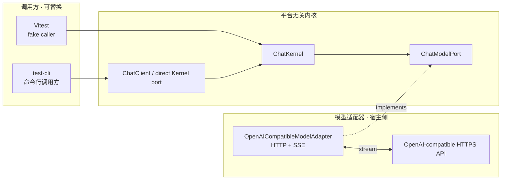
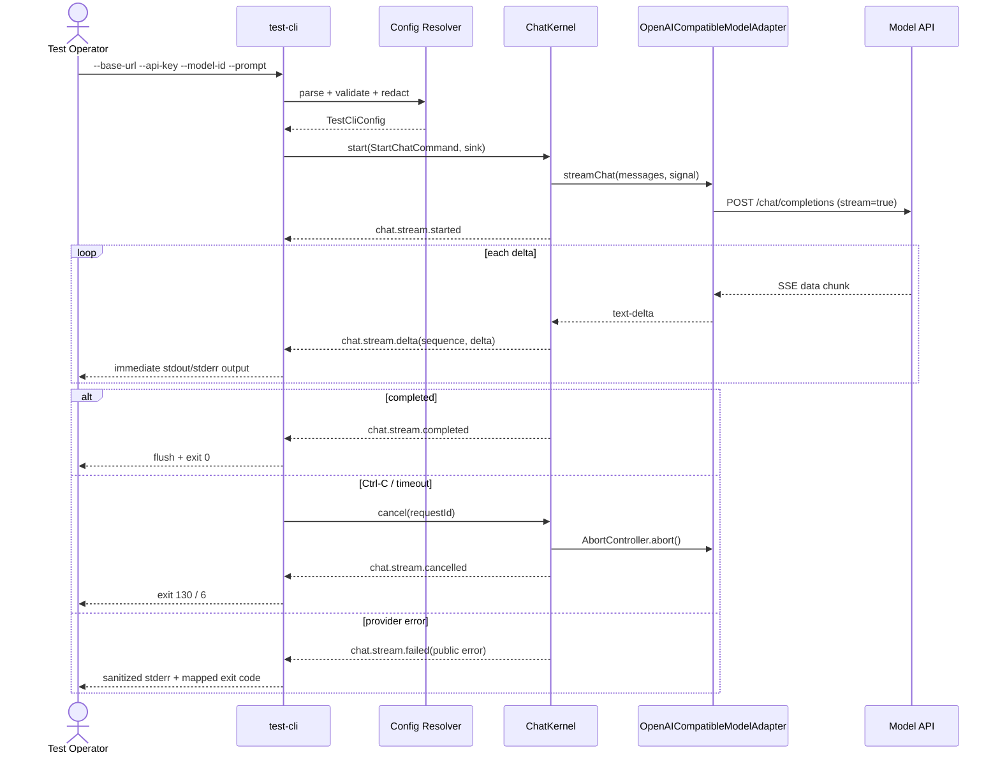

# test-cli 命令行流式测试架构要求

> 分支：`test-cli`  
> 文档性质：CLI 架构与接口要求；当前分支已按本文档完成基础实现。
> 目标：通过命令行直接验证单模型、单会话、流式输出内核。

## 1. 目标与非目标

### 1.1 目标

新增一个无前端依赖的测试 CLI，作为现有 `ChatKernel` 的独立调用方，允许测试人员通过命令行提供：

- OpenAI-compatible API Base URL。
- API Key。
- Model ID。
- 一条提示词。
- 可选输出格式和超时。

CLI 必须真实走 `ChatModelPort`、`ChatKernel` 和流式事件链路，不得绕过 Core 直接拼装一套请求逻辑。

### 1.2 非目标

- 不创建 React 页面、Debug Renderer 或 CLI REPL。
- 不修改 `ChatKernel` 的业务接口以适配 CLI。
- 不在 CLI 中实现第二套消息状态机、取消逻辑或 SSE 解析器。
- 不保存会话、提示词、API Key 或模型响应。
- 不加入重试、并发、多模型、多会话、工具调用、Markdown 渲染。
- 不在 CI 中访问真实模型服务；真实网络调用只能由人工本地执行。

## 2. 解耦原则



必须满足：

- `test-cli` 可以在没有 Electron、BrowserWindow、Preload、React 或 DOM 的 Node.js 环境运行。
- CLI 只依赖 `chat-contracts`、`chat-core` 和共享的模型适配器包。
- CLI 不得依赖 `apps/desktop` 的 Electron Host，也不得导入 `electron`。
- `ChatKernel` 不知道命令来自 CLI、测试还是未来 UI。
- CLI 不得直接调用 `fetch`、解析 SSE 或修改 Core 内部状态；这些职责属于共享 `OpenAICompatibleModelAdapter`。
- 如果当前模型适配器仍位于 `apps/desktop/src/main`，实现 Agent 应先将其抽取到 `packages/chat-model-adapters`，再由 Desktop 和 test-cli 共同依赖，禁止复制两份 Provider 实现。

## 3. 推荐目录结构

```text
.
├── apps
│   └── test-cli
│       ├── package.json
│       ├── tsconfig.json
│       └── src
│           ├── main.ts
│           ├── cli-args.ts
│           ├── cli-config.ts
│           ├── cli-runner.ts
│           ├── cli-output.ts
│           └── cli-exit-codes.ts
├── packages
│   └── chat-model-adapters
│       ├── package.json
│       └── src
│           ├── openai-compatible-model.adapter.ts
│           └── index.ts
└── tests
    └── cli
        ├── cli-args.test.ts
        ├── cli-config.test.ts
        ├── cli-runner.test.ts
        └── cli-output.test.ts
```

目录职责：

| 路径 | 职责 | 禁止内容 |
|---|---|---|
| `apps/test-cli/src/main.ts` | 进程入口、调用 runner、设置退出码 | Core 业务、SSE 解析 |
| `cli-args.ts` | 解析命令行参数 | 读取 API Key、网络请求 |
| `cli-config.ts` | 合并参数与环境变量、校验配置 | 打印 secret |
| `cli-runner.ts` | 生成命令、创建 Kernel、订阅事件、协调取消 | React、Electron、第二套状态机 |
| `cli-output.ts` | text/jsonl 输出策略 | 请求配置、API Key |
| `cli-exit-codes.ts` | 稳定退出码映射 | 业务请求 |
| `packages/chat-model-adapters` | 共享模型适配器和 SSE 转换 | CLI 参数、终端输出 |
| `tests/cli` | CLI 纯单测和 fake integration | 真实 API Key、真实网络 |

## 4. CLI 命令契约

### 4.1 命令入口

根目录必须提供一个明确的脚本入口，建议命名为：

```text
pnpm cli:test <options>
```

该脚本只负责转发参数到 `apps/test-cli`，不得把 CLI 逻辑写入根目录脚本或 Shell 字符串。

### 4.2 参数与环境变量

| 选项 | 环境变量 | 必需 | 说明 |
|---|---|---:|---|
| `--base-url <url>` | `AI_API_BASE_URL` | 是 | OpenAI-compatible API 根地址，例如 `https://host/v1` |
| `--api-key <key>` | `AI_API_KEY` | 是 | Provider 认证密钥 |
| `--model-id <id>` | `AI_MODEL_ID` | 是 | 单一模型标识 |
| `--prompt <text>` | 无 | 与 stdin 二选一 | 本次唯一提示词 |
| `--timeout-ms <n>` | `AI_CLI_TIMEOUT_MS` | 否 | 默认 120000；必须为正整数 |
| `--format <text/jsonl>` | `AI_CLI_FORMAT` | 否 | 取值 `text` 或 `jsonl`，默认 `text` |
| `--no-color` | `NO_COLOR` | 否 | 禁用终端颜色和控制符 |
| `--help` | 无 | 否 | 输出帮助并以 0 退出 |
| `--version` | 无 | 否 | 输出版本并以 0 退出 |

配置优先级固定为：

```text
命令行选项 > 环境变量 > 无默认值
```

`--prompt` 未提供时，从 stdin 读取一次完整输入；stdin 为空必须报参数错误。当前不实现交互式多轮 REPL。

### 4.3 参数校验

- `baseUrl` 必须是 `http` 或 `https` URL，去除末尾 `/` 后再交给 adapter。
- `apiKey` 和 `modelId` 必须是非空字符串；禁止自动填充假值。
- `prompt` 必须是非空、去除首尾空白后仍有内容的字符串。
- 复用 `chat-contracts` 的消息长度限制；CLI 不得绕过 `StartChatCommandSchema` 约束。
- 未知参数、重复互斥参数、无值参数必须给出明确错误并以参数错误码退出。
- `--api-key` 可以支持，但帮助文本必须提示：命令行参数可能出现在进程列表中，优先使用 `AI_API_KEY` 环境变量。

## 5. CLI 与 Core 的调用流程



约束：

- CLI 必须先订阅事件，再调用 `start`。
- 每次 CLI 进程只创建一个 `conversationId`、一个 `requestId` 和一个 `ChatKernel`。
- `messages` 只包含一条 `user` 消息；本阶段 CLI 不实现多轮输入。
- `assistantMessageId` 由 CLI 生成，不能使用固定常量。
- Ctrl-C、超时和正常取消必须调用同一个 `cancel` 端口；不得直接中止 adapter 的内部 reader。
- 收到 `completed`、`cancelled` 或 `failed` 后只允许执行一次退出流程。
- 进程退出前必须清理 stdin listener、signal listener 和 adapter stream。

## 6. 流式输出协议

### 6.1 text 模式（默认）

- `stdout` 只输出 assistant 的文本 delta，收到一个 delta 就立即 `process.stdout.write`。
- `stderr` 输出状态、诊断、取消提示和错误；不得把日志混入 stdout。
- 不输出 API Key、Authorization header、完整请求体、Provider 原始响应或堆栈。
- 正常完成时 stdout 最后应有换行；空响应也必须正常退出。
- 在非 TTY 管道中不得输出 ANSI 控制符。

示意：

```text
$ pnpm cli:test --base-url https://host/v1 --model-id model --prompt "你好"
你好！这是流式返回的内容。
```

### 6.2 jsonl 模式

`--format jsonl` 时，stdout 每行输出一个 JSON 对象，事件语义必须能被自动化测试消费：

```json
{"type":"chat.stream.started","requestId":"...","conversationId":"...","assistantMessageId":"..."}
{"type":"chat.stream.delta","requestId":"...","sequence":0,"delta":"你好"}
{"type":"chat.stream.completed","requestId":"...","finishReason":"stop"}
```

要求：

- 字段名称和 `ChatEvent` 保持一致，不能另造 `chunk`、`piece`、`done` 等同义协议。
- `emittedAt` 可以保留；不得输出 secret 或内部错误字段。
- jsonl 模式下 stdout 只能有 JSONL，诊断仍写 stderr。
- delta 顺序必须与 Core 事件中的 `sequence` 一致；不得在 CLI 端重排。

## 7. 退出码契约

退出码必须集中定义在 `cli-exit-codes.ts`，调用方不得散落魔法数字：

| 退出码 | 名称 | 条件 |
|---:|---|---|
| `0` | `SUCCESS` | 收到 completed |
| `1` | `UNKNOWN_ERROR` | 未分类错误 |
| `2` | `INVALID_ARGUMENTS` | 参数、stdin、配置校验失败 |
| `3` | `PROVIDER_UNAUTHORIZED` | 401/403 |
| `4` | `PROVIDER_RATE_LIMITED` | 429 |
| `5` | `PROVIDER_UNAVAILABLE` | 网络失败或 5xx |
| `6` | `REQUEST_TIMEOUT` | CLI 超时后完成 cancel |
| `130` | `INTERRUPTED` | 用户 Ctrl-C |

`ChatPublicError.retryable` 只影响诊断信息，不自动触发重试。失败消息必须使用 Core 的安全错误，不得把 adapter 原始错误文本直接写到终端。

## 8. 配置和 Secret 安全要求

- API Key 只存在于 CLI 进程内的配置对象和 adapter 私有字段，不能进入 `StartChatCommand`、`ChatEvent`、日志或退出错误。
- 优先从 `AI_API_KEY` 环境变量读取；命令行支持只是测试便利，不应在 README 示例中使用真实密钥。
- `--help`、错误、调试日志和 jsonl 事件都不得回显 API Key，即使 key 出现在 malformed input 中也要脱敏。
- 不把完整 URL、query string 或 Authorization header 写入日志；Base URL 可以显示，但必须去除 query/hash。
- `.env`、`.env.*.local` 继续被 `.gitignore` 忽略；不新增包含真实 Key 的 fixture。
- 真实网络 smoke test 由人工设置临时环境变量执行，CI 只使用 fake fetch/fake model。

## 9. 测试要求

### 9.1 单元测试

- `cli-args.test.ts`：短/长参数、未知参数、缺值、互斥 prompt/stdin、help/version。
- `cli-config.test.ts`：CLI > env 优先级、URL/model/key/prompt 校验、secret 脱敏。
- `cli-runner.test.ts`：started/delta/completed 链路、cancel、timeout、失败映射、只退出一次。
- `cli-output.test.ts`：text stdout、stderr 分离、jsonl 每行合法、无 ANSI（管道模式）。
- 所有测试禁止启动 Electron，禁止真实网络，禁止真实 API Key。

### 9.2 模型适配器测试

- 复用现有 adapter 的 fake SSE 测试，并增加无尾部换行、分片跨行、`[DONE]`、空 delta 和 malformed chunk 场景。
- HTTP 401/403/429/5xx、网络异常和 AbortError 必须映射到约定的 `ChatErrorCode`。
- adapter 原始响应对象不得进入 CLI output 或 Core event。

### 9.3 人工 smoke test（不进 CI）

```text
AI_API_BASE_URL=<real-base-url> \\
AI_API_KEY=<temporary-key> \\
AI_MODEL_ID=<real-model> \\
pnpm cli:test --prompt "请只回复 OK"
```

人工确认：

1. 首字节/首个 delta 无明显等待后即可看到输出。
2. 输出过程中 Ctrl-C 能结束请求，不留下 Node 进程或悬挂连接。
3. `--format jsonl` 可被 `jq` 或脚本逐行消费。
4. 401、429、断网时退出码和 stderr 符合契约，且看不到 API Key。
5. 将 stdout 重定向到文件时，文件只包含回答文本或 JSONL，不包含诊断日志。

## 10. 验收标准

本分支的完成条件是 CLI 架构可被另一个 Agent 按本文实现并验证：

- `pnpm typecheck:test-cli`、`pnpm test:test-cli`、`pnpm build:test-cli` 全部通过。
- Core 原有 `pnpm typecheck:core`、`pnpm test:core`、`pnpm build:core` 不受影响。
- `pnpm lint:boundaries` 通过；`apps/test-cli` 不依赖 Electron，Core 不依赖 CLI。
- Base URL、API Key、Model ID、prompt 均可按本文件的参数/env 规则输入。
- text 和 jsonl 两种模式都能实时消费流式 delta。
- completed、cancelled、timeout、401/403、429、5xx/网络错误均有稳定退出码。
- stdout/stderr 分工正确，任何输出都不泄露 API Key。
- 没有创建 React UI，也没有将 CLI 逻辑塞进 Electron Host。
- CI 不访问真实模型；人工 smoke test 使用临时密钥且不提交配置文件。

## 11. Agent 实现顺序

1. 先确认 `chat-core` 和 `chat-contracts` 现有接口，不修改其语义。
2. 将 OpenAI-compatible adapter 抽取为可被 Desktop 与 CLI 共同依赖的纯 Node package。
3. 实现 CLI 配置/参数解析和退出码，不接网络。
4. 接入 `ChatKernel` 与 fake model，完成 CLI runner 和输出单测。
5. 接入 fake SSE/HTTP，完成 adapter 与错误映射测试。
6. 添加 root `cli:test`、`typecheck:test-cli`、`test:test-cli`、`build:test-cli` 脚本。
7. 运行自动检查；最后由人工在临时环境变量下执行 smoke test。

实现 Agent 不得在本分支添加 React 页面、修改 Core 为 CLI 增加特判、提交真实 `.env`、或把 API Key 写入测试 fixture。
