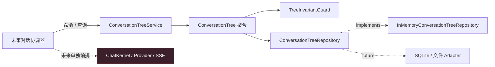
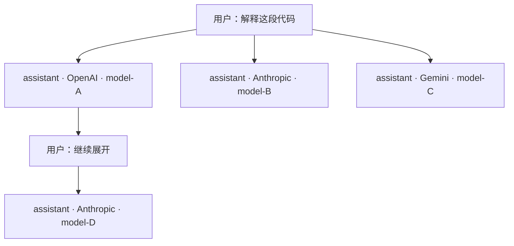

# 会话树内核实施计划

> 工作分支：`feat/conversation-tree`  
> 文档性质：仅架构、接口、实施步骤与验收要求；本阶段不编写会话树实现代码。  
> `/hooks` 停止点：会话树包及其独立测试完成后立即停止，禁止接入现有 `ChatKernel`、模型 Adapter、Electron Host、CLI 或 Renderer。

## 1. 需求解释与本计划假设

本计划将用户要求落实为以下硬约束：

1. 会话数据必须构成真正的有根树：非空、单根、节点最多一个父节点、父子边不跨树、全图连通且无环。
2. 一棵 `ConversationTree` 就是一个会话；`ConversationTreeId` 同时承担会话标识，不再并列维护另一套 `ConversationId`。
3. 原需求第 3 点语句未写完整。本计划按第 4 点补全为：预留遍历、路径、叶子、分支、快照、校验、删除和仓储接口，供后续会话管理使用。
4. 节点增删、从任意节点继续、从历史节点分叉均由会话树内核负责，但不会调用模型。
5. 模型请求和流式传输完全位于会话树之外。同一棵树的不同 assistant 节点可以记录不同的模型来源，但树内核不认识 API 协议实现。
6. 节点只保存对话领域数据，不加入坐标、折叠、选中、颜色、组件状态等前端字段。
7. 本阶段完成后必须在 `/hooks` 停止点结束，不进入现有 AI 对话功能的集成工作。

## 2. 范围与非目标

### 2.1 本阶段目标

- 新建独立包 `packages/conversation-tree`，npm package 名称为 `chat-conversation-tree`。
- 实现纯 TypeScript 的树聚合、结构校验、命令/查询服务和内存仓储。
- 提供稳定、可供未来会话管理调用的公开接口。
- 对新建、追加、分叉、删除、遍历、快照恢复、版本冲突和恶意环数据进行完整测试。
- 保证包不依赖 Electron、React、Node 网络模块、`chat-core`、`chat-model-adapters` 或 Provider SDK。

### 2.2 本阶段明确不做

- 不修改 `ChatKernel`，不把现有线性 `MessageNode[]` 改造成树。
- 不修改 `StartChatCommand`、`ChatEvent`、IPC channel、Preload API 或 CLI 参数。
- 不把流式 delta 写入树，不在树内保存 `AbortController`、request reader 或 Provider 响应。
- 不实现 SQLite、文件数据库或云同步，只定义 repository port 并实现内存版本。
- 不实现会话列表 UI、树可视化、分支选择 UI、重命名、置顶或搜索。
- 不实现节点移动、重新挂载、合并分支或 DAG；这些行为会引入环和历史歧义。
- 不实现模型 fallback、多模型并发或自动选择 Provider。

## 3. 领域边界与总体架构



必须保持的依赖方向：

```text
未来协调器 ──> 会话树公开接口
未来协调器 ──> 模型流式接口

会话树内核 -X-> ChatKernel
会话树内核 -X-> ChatModelPort
会话树内核 -X-> ProviderConfig / Adapter
会话树内核 -X-> Electron / React / CLI
```

会话树与模型流之间没有直接依赖。未来集成时由一个新的 application coordinator 完成“读取某条 root-to-node 路径 → 映射为模型 messages → 发起请求 → 请求成功后追加 assistant 节点”，但该 coordinator 不属于本阶段。

配套可交互架构图：`docs/plans/CONVERSATION_TREE_ARCHITECTURE.html`。

## 4. 会话、树与分支的定义

### 4.1 会话定义

- 一个 `ConversationTreeId` 唯一标识一个会话。
- 两棵树之间不得共享节点，也不得通过 `parentId` 建立引用。
- 创建会话时必须同时提供第一个真实对话节点，因此领域中的树始终非空。
- 如果未来 UI 需要“尚未输入内容的空白会话”，它应作为 UI/application draft 存在，不进入会话树领域。

### 4.2 分支定义

- 分支不是单独持久化的实体。
- 一条分支定义为从根节点到某个叶节点的唯一路径。
- 一个节点拥有两个或更多直接子节点时，该节点自然成为分支点。
- 分支查询结果以叶节点 ID 标识；不另外创建容易失同步的 `BranchId`。
- 当前所选分支属于未来 application/session state，不保存在树结构中。树查询统一显式接收目标节点或叶节点 ID。

示例：



这里仍然只有一个会话树；`U1` 是分支点，不同 assistant 节点可以来自不同模型与不同协议。

## 5. 必须永久成立的树不变量

所有创建、恢复和变更操作完成后必须满足：

| 编号 | 不变量 | 失败错误码 |
|---|---|---|
| T01 | `treeId` 非空，且 snapshot 中所有节点的 `treeId` 相同 | `TREE_ID_MISMATCH` |
| T02 | 节点 ID 在树内唯一 | `DUPLICATE_NODE_ID` |
| T03 | 恰有一个 `parentId === null` 的根节点 | `INVALID_ROOT_COUNT` |
| T04 | `rootId` 指向该唯一根节点 | `ROOT_ID_MISMATCH` |
| T05 | 每个非根节点的父节点存在于同一 snapshot | `PARENT_NOT_FOUND` |
| T06 | 从根遍历可访问全部节点，不存在孤立子图 | `DISCONNECTED_NODE` |
| T07 | DFS 的 visiting 集合中不得再次遇到当前节点 | `CYCLE_DETECTED` |
| T08 | 新节点只能指向已经存在的父节点 | `PARENT_NOT_FOUND` |
| T09 | 节点创建后，`id`、`treeId`、`parentId`、`sequence` 不可修改 | `IMMUTABLE_FIELD` |
| T10 | `sequence` 在树内唯一且父节点 sequence 小于子节点 | `INVALID_SEQUENCE` |
| T11 | 节点 content 去除首尾空白后不得为空 | `INVALID_NODE_CONTENT` |
| T12 | 只有 assistant 节点可以携带生成来源 | `INVALID_GENERATION_PROVENANCE` |

虽然“只允许新增节点且不开放 reparent”已经能让正常命令在构造上避免环，`hydrate(snapshot)` 仍必须执行完整 DFS 校验，以防持久化损坏、旧版本迁移或恶意输入带入环。

禁止用“遍历达到最大深度后停止”的方式掩盖环。发现环必须返回明确的 `CYCLE_DETECTED`。

## 6. 数据模型

建议放在 `packages/conversation-tree/src/domain/`。

### 6.1 标识与角色

```ts
export type ConversationTreeId = string
export type ConversationNodeId = string
export type ConversationRole = 'system' | 'user' | 'assistant'
```

本阶段不复用 `chat-contracts` 的 `MessageNode`。原因是现有类型包含 `streaming`、`failed`、`cancelled` 等请求生命周期状态，直接复用会把树重新耦合到流式请求。

### 6.2 生成来源

```ts
export interface GenerationProvenance {
  readonly providerId: string
  readonly modelId: string
}
```

约束：

- 字段仅用于回答“这条 assistant 消息由哪个模型生成”，属于对话历史的一部分。
- `providerId` 是不透明字符串，树包不得 import `ModelProviderKind` 或对 `openai-compatible`、`anthropic`、`gemini` 建立 switch。
- 不保存 API Key、Base URL、HTTP Header、协议版本、请求体、原始 Provider 响应或错误堆栈。
- 不保存 requestId、SSE sequence、AbortSignal 或“当前正在生成”的状态。
- 同一树的不同 assistant 节点可以使用不同的 `providerId` 和 `modelId`。

### 6.3 会话节点

```ts
export interface ConversationNode {
  readonly id: ConversationNodeId
  readonly treeId: ConversationTreeId
  readonly parentId: ConversationNodeId | null
  readonly role: ConversationRole
  readonly content: string
  readonly sequence: number
  readonly createdAt: string
  readonly generatedBy?: GenerationProvenance
}
```

不得加入以下字段：

```text
x / y / position / selected / collapsed / color / cssClass
component / icon / avatar / renderType
isStreaming / abortController / providerResponse
```

节点按“完成后的对话事实”保存。节点内容保持不可变；未来若用户编辑历史消息，应从目标父节点创建新分支，而不是原地改写旧节点。

### 6.4 树快照

```ts
export interface ConversationTreeSnapshot {
  readonly schemaVersion: 1
  readonly treeId: ConversationTreeId
  readonly rootId: ConversationNodeId
  readonly version: number
  readonly nextSequence: number
  readonly createdAt: string
  readonly updatedAt: string
  readonly nodes: readonly ConversationNode[]
}
```

要求：

- Snapshot 必须是可直接 JSON 序列化的 plain data，不暴露内部 `Map` 或可变数组。
- `toSnapshot()` 返回深拷贝或完全不可变的数据，外部修改不得影响聚合内部状态。
- `hydrate()` 先校验 `schemaVersion`，再执行完整结构校验。
- 每次成功 mutation 将 `version + 1`；查询不改变 version。
- `nextSequence` 只增不减，删除节点后不得复用旧 sequence。

### 6.5 派生视图

```ts
export interface ConversationBranch {
  readonly leafNodeId: ConversationNodeId
  readonly nodeIds: readonly ConversationNodeId[]
}

export interface ConversationTreeDescriptor {
  readonly treeId: ConversationTreeId
  readonly rootId: ConversationNodeId
  readonly version: number
  readonly nodeCount: number
  readonly leafCount: number
  readonly createdAt: string
  readonly updatedAt: string
}
```

Descriptor 不包含标题、封面、排序权重或 UI 状态。后续会话管理若需要这些内容，应新建独立 conversation catalog，而不是污染节点结构。

## 7. 公开接口设计

### 7.1 统一 Result 与错误

```ts
export type ConversationTreeResult<T> =
  | { readonly ok: true; readonly value: T }
  | { readonly ok: false; readonly error: ConversationTreeError }

export interface ConversationTreeError {
  readonly code: ConversationTreeErrorCode
  readonly message: string
  readonly details?: Readonly<Record<string, string | number | boolean>>
}
```

公开 service 方法不得依靠调用方解析异常字符串。领域失败返回 typed result；真正不可恢复的编程错误才允许抛异常。

最少错误码：

```ts
type ConversationTreeErrorCode =
  | 'TREE_NOT_FOUND'
  | 'TREE_ALREADY_EXISTS'
  | 'NODE_NOT_FOUND'
  | 'DUPLICATE_NODE_ID'
  | 'PARENT_NOT_FOUND'
  | 'NODE_HAS_CHILDREN'
  | 'ROOT_DELETE_REQUIRES_TREE_DELETE'
  | 'INVALID_ROOT_COUNT'
  | 'ROOT_ID_MISMATCH'
  | 'TREE_ID_MISMATCH'
  | 'DISCONNECTED_NODE'
  | 'CYCLE_DETECTED'
  | 'INVALID_SEQUENCE'
  | 'INVALID_NODE_CONTENT'
  | 'INVALID_GENERATION_PROVENANCE'
  | 'VERSION_CONFLICT'
  | 'UNSUPPORTED_SNAPSHOT_VERSION'
```

### 7.2 聚合根接口

`ConversationTree` 是同步、纯内存领域对象，不负责 IO：

```ts
export class ConversationTree {
  static create(input: CreateConversationTreeInput, clock: Clock): ConversationTreeResult<ConversationTree>
  static hydrate(snapshot: ConversationTreeSnapshot): ConversationTreeResult<ConversationTree>

  appendNode(input: AppendConversationNodeInput, clock: Clock): ConversationTreeResult<ConversationNode>
  forkFromNode(input: ForkConversationNodeInput, clock: Clock): ConversationTreeResult<ForkResult>
  deleteNode(input: DeleteConversationNodeInput, clock: Clock): ConversationTreeResult<DeleteNodesResult>

  getNode(nodeId: ConversationNodeId): ConversationTreeResult<ConversationNode>
  hasNode(nodeId: ConversationNodeId): boolean
  getChildren(nodeId: ConversationNodeId): ConversationTreeResult<readonly ConversationNode[]>
  getAncestors(nodeId: ConversationNodeId): ConversationTreeResult<readonly ConversationNode[]>
  getPathToNode(nodeId: ConversationNodeId): ConversationTreeResult<readonly ConversationNode[]>
  getDescendants(nodeId: ConversationNodeId): ConversationTreeResult<readonly ConversationNode[]>
  listLeaves(): readonly ConversationNode[]
  listBranches(): readonly ConversationBranch[]
  validate(): ConversationTreeResult<void>
  toSnapshot(): ConversationTreeSnapshot
  toDescriptor(): ConversationTreeDescriptor
}
```

`forkFromNode()` 内部可以复用 `appendNode()`，但保留单独名称，以表达调用方正在从历史节点创建新走向。返回值应包含：

```ts
export interface ForkResult {
  readonly node: ConversationNode
  readonly branchPointId: ConversationNodeId
  readonly siblingCountAfterCreate: number
  readonly createdActualFork: boolean
}
```

当父节点在操作前已存在至少一个 child 时，`createdActualFork` 为 `true`。

### 7.3 节点创建输入

```ts
export interface ConversationNodeDraft {
  readonly id: ConversationNodeId
  readonly role: ConversationRole
  readonly content: string
  readonly generatedBy?: GenerationProvenance
}

export interface CreateConversationTreeInput {
  readonly treeId: ConversationTreeId
  readonly root: ConversationNodeDraft
}

export interface AppendConversationNodeInput {
  readonly parentId: ConversationNodeId
  readonly node: ConversationNodeDraft
}
```

调用方提供 ID 是为了让未来协调器能在不同模块间安全关联节点；`treeId`、`parentId`、时间、sequence 和 version 由聚合填充，调用方不能伪造。

### 7.4 删除接口与语义

```ts
export type DeleteNodeMode = 'leaf-only' | 'subtree'

export interface DeleteConversationNodeInput {
  readonly nodeId: ConversationNodeId
  readonly mode?: DeleteNodeMode
}

export interface DeleteNodesResult {
  readonly deletedNodeIds: readonly ConversationNodeId[]
  readonly newVersion: number
}
```

删除规则：

- 默认 mode 为 `leaf-only`，降低误删风险。
- `leaf-only` 删除有子节点的节点时返回 `NODE_HAS_CHILDREN`，树保持原样。
- `subtree` 删除目标节点及其全部后代，返回确定性的 pre-order `deletedNodeIds`。
- 两种模式都禁止删除根节点；删除整棵树必须调用 service 的 `deleteTree()`。
- 删除失败必须原子回滚，不允许留下孤儿节点。
- 不提供“删除节点后把 children 自动挂到 parent”的行为，因为这会改写历史语义。

## 8. Application Service 与仓储 Port

### 8.1 仓储接口

```ts
export interface ConversationTreeRepository {
  create(snapshot: ConversationTreeSnapshot): Promise<ConversationTreeResult<void>>
  load(treeId: ConversationTreeId): Promise<ConversationTreeResult<ConversationTreeSnapshot>>
  save(
    snapshot: ConversationTreeSnapshot,
    expectedVersion: number
  ): Promise<ConversationTreeResult<void>>
  delete(treeId: ConversationTreeId, expectedVersion: number): Promise<ConversationTreeResult<void>>
  list(): Promise<ConversationTreeResult<readonly ConversationTreeDescriptor[]>>
}
```

`InMemoryConversationTreeRepository` 必须：

- 在读写时复制 snapshot，禁止引用泄漏。
- 原子检查 `expectedVersion`；不匹配返回 `VERSION_CONFLICT`。
- `create()` 遇到已有 treeId 返回 `TREE_ALREADY_EXISTS`。
- `list()` 顺序固定为 `createdAt` 升序，再以 `treeId` 作为稳定 tie-breaker。

### 8.2 Service 接口

```ts
export class ConversationTreeService {
  createTree(command: CreateTreeCommand): Promise<ConversationTreeResult<ConversationTreeSnapshot>>
  appendNode(command: AppendNodeCommand): Promise<ConversationTreeResult<ConversationTreeSnapshot>>
  forkFromNode(command: ForkFromNodeCommand): Promise<ConversationTreeResult<ConversationTreeSnapshot>>
  deleteNode(command: DeleteNodeCommand): Promise<ConversationTreeResult<DeleteNodesResult>>
  deleteTree(command: DeleteTreeCommand): Promise<ConversationTreeResult<void>>

  getTree(treeId: ConversationTreeId): Promise<ConversationTreeResult<ConversationTreeSnapshot>>
  getNode(treeId: ConversationTreeId, nodeId: ConversationNodeId): Promise<ConversationTreeResult<ConversationNode>>
  getPathToNode(treeId: ConversationTreeId, nodeId: ConversationNodeId): Promise<ConversationTreeResult<readonly ConversationNode[]>>
  getChildren(treeId: ConversationTreeId, nodeId: ConversationNodeId): Promise<ConversationTreeResult<readonly ConversationNode[]>>
  listLeaves(treeId: ConversationTreeId): Promise<ConversationTreeResult<readonly ConversationNode[]>>
  listBranches(treeId: ConversationTreeId): Promise<ConversationTreeResult<readonly ConversationBranch[]>>
  listTrees(): Promise<ConversationTreeResult<readonly ConversationTreeDescriptor[]>>
}
```

所有修改已有树的 command 必须携带 `expectedVersion`。Service 流程固定为：

```text
load snapshot
  → hydrate + invariant validation
  → execute one aggregate mutation
  → validate resulting tree
  → repository.save(snapshot, expectedVersion)
  → return immutable result
```

任一步失败都不得持久化部分结果。

## 9. 复杂度与确定性要求

| 操作 | 目标复杂度 | 说明 |
|---|---:|---|
| `hasNode` / `getNode` | O(1) | 聚合内部使用 `Map<NodeId, Node>` |
| `appendNode` / `forkFromNode` | O(1)，不含最终 invariant 审计 | 父节点存在且新 ID 唯一 |
| `getChildren` | O(k) | 维护内部 children index |
| `getPathToNode` | O(depth) | 沿 parent 链向根，再反转 |
| `getDescendants` / `delete subtree` | O(subtree size) | 使用 children index |
| `listLeaves` / `listBranches` | O(N) | 结果按 sequence 确定排序 |
| `hydrate` / `validate` | O(N) | DFS 三色标记或等价算法 |

所有数组结果必须具有确定顺序，默认按 `sequence` 升序。测试不得依赖 `Map` 插入顺序的偶然行为。

## 10. 推荐文件结构

```text
packages/conversation-tree/
├── package.json
├── tsconfig.json
└── src/
    ├── index.ts
    ├── conversation-tree.ts
    ├── conversation-tree.service.ts
    ├── tree-invariant.guard.ts
    ├── in-memory-conversation-tree.repository.ts
    ├── domain/
    │   ├── conversation-node.ts
    │   ├── conversation-tree.snapshot.ts
    │   ├── conversation-tree.types.ts
    │   └── conversation-tree.errors.ts
    ├── commands/
    │   ├── create-tree.command.ts
    │   ├── append-node.command.ts
    │   ├── fork-from-node.command.ts
    │   ├── delete-node.command.ts
    │   └── delete-tree.command.ts
    └── ports/
        ├── clock.port.ts
        └── conversation-tree.repository.ts

tests/conversation-tree/
├── conversation-tree.create.test.ts
├── conversation-tree.branch.test.ts
├── conversation-tree.delete.test.ts
├── conversation-tree.queries.test.ts
├── tree-invariant.guard.test.ts
├── conversation-tree.hydrate.test.ts
├── conversation-tree.service.test.ts
├── in-memory-repository.test.ts
└── conversation-tree.randomized-invariants.test.ts
```

公共导出只放在 `src/index.ts`。测试和未来调用方不得 import 包内部深层路径，以便后续重构实现。

## 11. 架构边界检查

扩展 `scripts/lint-boundaries.mjs`，为 `packages/conversation-tree` 添加检查：

### 11.1 允许依赖

- 生产依赖：无。
- 开发依赖：仅 `typescript`。
- 可使用标准语言数据结构；不得依赖数据库或事件总线库。

### 11.2 禁止 import 和符号

```text
electron
react
zustand
chat-core
chat-contracts
chat-model-adapters
OpenAICompatibleModelAdapter
AnthropicMessagesModelAdapter
GeminiGenerateContentModelAdapter
ChatKernel
ChatModelPort
fetch
AbortController
ipcMain / ipcRenderer / BrowserWindow
```

`providerId` 和 `modelId` 只是普通对话来源数据，不得触发任何 Provider 分支逻辑。

## 12. 实施步骤与 Agent 任务拆分

为避免多个 Agent 同时修改相同文件，建议按以下顺序执行。

### Agent A：领域类型与不变量

负责：

- package 基础结构、domain types、typed Result/error。
- `TreeInvariantGuard` 和 `hydrate()`。
- create snapshot、单根、父引用、同树、连通性、环、sequence 校验测试。

禁止：实现 repository、service 或接入现有 ChatKernel。

交付门槛：手工构造 `A → B → A`、双根、孤立节点、跨 treeId、缺失 parent 的 snapshot 均被准确拒绝。

### Agent B：聚合命令与查询

依赖 Agent A 的已稳定类型，负责：

- `appendNode`、`forkFromNode`。
- `deleteNode` 的 `leaf-only` / `subtree` 语义。
- 路径、children、ancestors、descendants、leaves、branches 查询。
- mixed provider/model provenance 测试。

交付门槛：任何成功 mutation 后 `validate()` 均通过；失败操作不改变 version 和 snapshot。

### Agent C：Repository 与 Service

依赖 A/B，负责：

- Repository port、InMemory 实现、深复制和 CAS version。
- `ConversationTreeService` 命令/查询编排。
- 两棵树隔离、并发版本冲突、删除整树、list descriptor 测试。

交付门槛：旧 version 保存失败，且 repository 中原 snapshot 不变。

### Agent D：边界、随机测试与验收

依赖 A/B/C，负责：

- `lint-boundaries` 规则。
- 随机序列 invariant 测试。
- package scripts、Vitest alias、全仓回归。
- 校对公开 export，不得修改现有 AI 对话代码。

交付门槛：全量验收命令通过，然后触发 `/hooks` 停止点。

## 13. 测试矩阵

### 13.1 创建与恢复

- 正常创建只有根节点的树，version 为 1，root sequence 为 0，nextSequence 为 1。
- 空 treeId、nodeId、content 被拒绝。
- assistant 可带 `generatedBy`；user/system 携带时被拒绝。
- Snapshot round-trip 后结构、顺序、version 完全一致。
- 不支持的 `schemaVersion` 被拒绝。

### 13.2 无环与结构安全

- self-cycle：A.parentId = A。
- two-node cycle：A.parentId = B，B.parentId = A。
- deeper cycle：A → B → C → B。
- 双根、零根、parent 缺失、孤立子图。
- 跨 treeId 父子关系。
- 重复 nodeId、重复 sequence、parent sequence 大于 child。

### 13.3 追加与分支

- 根后正常追加多个节点。
- 从叶节点继续形成线性路径。
- 从历史节点创建第二个 child，形成分支点。
- 同一 parent 下多个 sibling 顺序稳定。
- 重复 nodeId 失败且 snapshot 不变。
- 在不存在的 parent 下追加失败。
- 一棵树中 OpenAI、Anthropic、Gemini 来源的 assistant 节点可以共存；树逻辑不根据 provider 分支。

### 13.4 查询

- root、内部节点、leaf 的 path 正确。
- children、ancestors、descendants 顺序正确。
- `listLeaves` 仅返回叶节点。
- `listBranches` 返回每条完整 root-to-leaf 路径。
- 查询不存在节点返回 `NODE_NOT_FOUND`。
- 返回结果被外部修改后，内部 snapshot 不变。

### 13.5 删除

- `leaf-only` 正常删除叶节点。
- `leaf-only` 删除分支点返回 `NODE_HAS_CHILDREN`。
- `subtree` 删除完整子树且不影响 sibling branch。
- 根节点不能通过 deleteNode 删除。
- `deleteTree` 删除整棵树。
- 删除不存在节点失败且 version 不变。
- 删除后 leaves、branches、descriptor 重新计算正确。

### 13.6 版本与仓储

- create 相同 treeId 冲突。
- expectedVersion 正确时保存成功。
- 两个并发 snapshot 只有第一个保存成功，第二个返回 `VERSION_CONFLICT`。
- load/save/list 返回深复制。
- list 排序稳定。

### 13.7 随机不变量测试

固定随机种子执行至少 500 次 append、fork、leaf delete、subtree delete 混合操作；每次成功操作后断言：

```text
validate() 成功
单根
无环
所有节点从 root 可达
parent 存在且同树
sequence 唯一且沿边递增
snapshot round-trip 成功
```

固定 seed 必须打印在失败信息中，保证问题可复现。无需为了本阶段引入 property-testing 第三方依赖。

## 14. 可修改文件范围

实现 Agent 允许修改：

```text
packages/conversation-tree/**
tests/conversation-tree/**
scripts/lint-boundaries.mjs
vitest.config.ts
package.json                 # 仅增加 conversation-tree 测试脚本
pnpm-lock.yaml               # workspace 元数据变化
docs/plans/CONVERSATION_TREE_*
```

本阶段禁止修改：

```text
packages/chat-core/**
packages/chat-contracts/**
packages/chat-model-adapters/**
apps/desktop/**
apps/test-cli/**
apps/debug-renderer/**
tests/core/**
tests/adapters/**
tests/transport/**
tests/cli/**
tests/debug-renderer/**
```

如果实现必须修改禁止路径，Agent 应停止并报告设计冲突，不得自行扩大范围。

## 15. 验收命令

建议新增根脚本：

```json
{
  "typecheck:conversation-tree": "pnpm --filter chat-conversation-tree run typecheck",
  "test:conversation-tree": "vitest run tests/conversation-tree",
  "build:conversation-tree": "pnpm --filter chat-conversation-tree run build"
}
```

最终执行：

```bash
pnpm typecheck:conversation-tree
pnpm test:conversation-tree
pnpm build:conversation-tree
pnpm lint:boundaries
pnpm typecheck
pnpm test
pnpm build
git diff --check
```

## 16. 最终验收标准

- 任意公开命令都不能产生环、孤儿节点、双根或跨树边。
- `hydrate()` 能拒绝手工伪造的环和损坏 snapshot。
- 一棵树就是一个会话，不存在第二套会话 ID 映射。
- 分支由结构派生，不维护冗余 Branch entity。
- 删除操作原子、安全，默认拒绝递归误删。
- 同一树中不同 assistant 节点可记录不同 provider/model 来源。
- 会话树 package 不依赖任何请求、网络、Electron 或 UI 模块。
- 所有公开结果稳定排序且不可从外部修改内部状态。
- Repository 具备 optimistic version conflict 保护。
- 现有全仓测试仍通过。
- Git diff 未触及第 14 节禁止路径。

## 17. `/hooks` 强制停止点

当第 15 节全部命令通过后，执行 Agent 必须：

1. 输出新增/修改文件清单。
2. 输出会话树单测数量与全仓回归结果。
3. 明确报告“会话树尚未接入现有 AI 对话链路”。
4. 立即停止，不创建 coordinator，不修改 ChatKernel，不新增 IPC，不修改 CLI/Renderer。
5. 等待用户发出下一阶段集成指令。

以下行为视为越过 `/hooks`，即使测试通过也不应验收：

- 从 `ChatKernel` import 或实例化 `ConversationTreeService`。
- 将 stream delta 直接写入 ConversationTree。
- 为树新增 Provider Adapter、fetch 或 AbortSignal 依赖。
- 在 Electron Preload/IPC 暴露会话树 API。
- 创建前端 tree store、React hook 或树状 UI。

本阶段的最终产物只能是：独立会话树包、独立测试、边界规则和文档。
